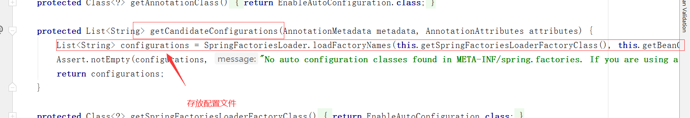
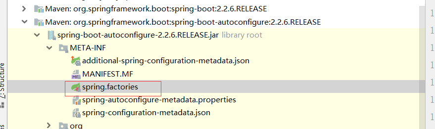
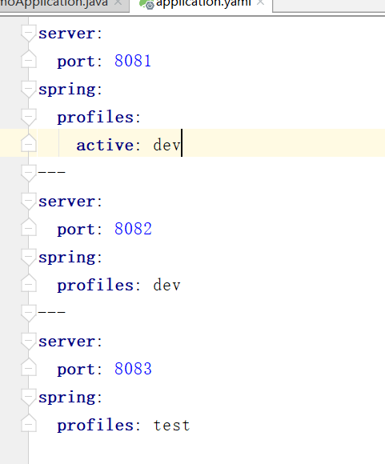
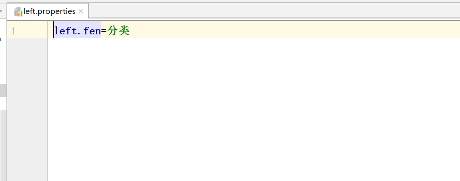
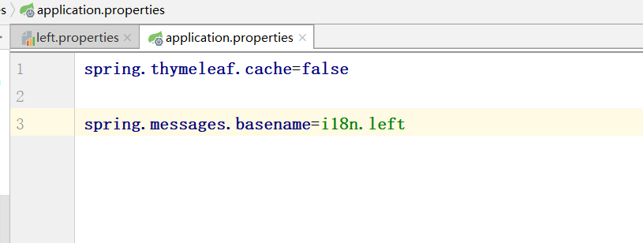
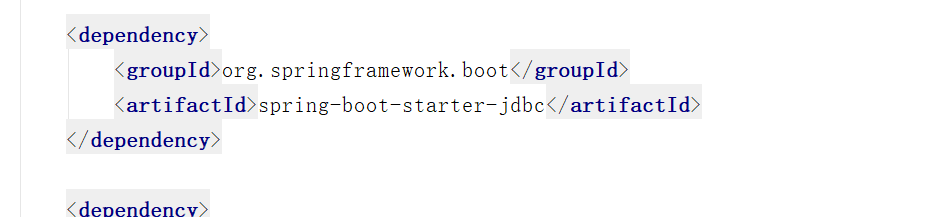
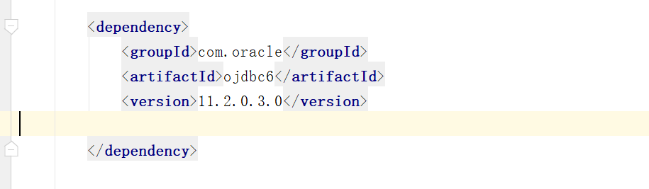
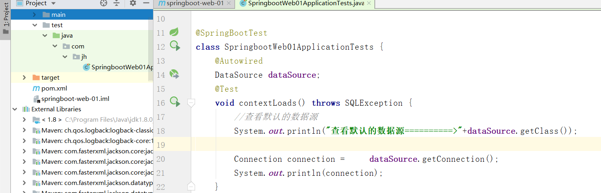
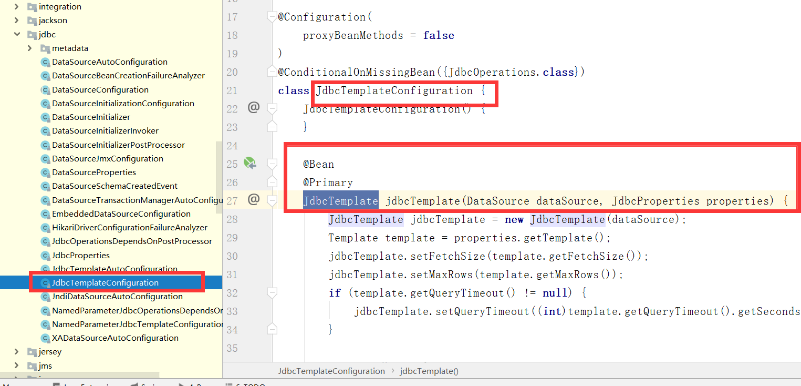
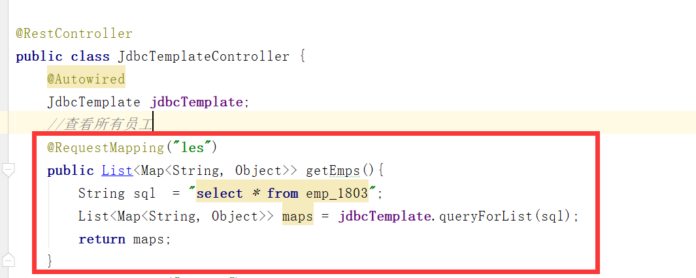

springboot自动装配原理初探

pom.xml

**核心依赖**

- spring-boot-dependencies：该依赖在父工程中
- 我们在写springboot依赖的时候，不需要指定版本，就是因为这些版本仓库

**启动器**

- ```xml
    <dependency>
        <groupId>org.springframework.boot</groupId>
        <artifactId>spring-boot-starter</artifactId>
    </dependency>
    ```

- 启动器：就是springboot的启动场景

- 比如spring-boot-starter-web，springboot就会自动导入web环境下的所有依赖

- springboot将所有的功能场景，编程一个一个的启动器

- 我们使用什么功能，只需要添加相应的启动器即可

**主程序**

- @SpringBootApplication:标注这个类是springboot应用！

- ```bash
    @SpringBootConfiguration:springboot的配置
    	@Configuration：表示spring配置类
    		@Component：spring的一个组件
    @EnableAutoConfiguration：自动配置
    	@AutoConfigurationPackage：自动配置包
    	@Import({AutoConfigurationImportSelector.class})：导入选择器
    		AutoConfigurationImportSelector.class
    		getCandidateConfigurations();  获取配置的方法
    			
    ```

- 

- 自动配置的核心文件


*springboot自动装配*	**精髓**

- Springboot会加载大量的自动配置类
- 看我们需要的功能有没有在Springboot默认的装配类中
- 我们再看这个自动配置类中配置了那些组件（只要我们要用的组件在内，我们就不需要手动配置了）
- 给容器中自动配置类添加组件的时候，会从properties类中获取某些属性，我们只需要在配置文件中指定这些属性的值即可
- XXXAutoConfiguration：自动配置类：给容器中添加组件
- XXXProperties：封装配置文件中的相关属性

# 谈谈你对springboot的理解

- **自动装配**

    ```
    @SpringBootApplication		=>@EnableAutoConfiguration=>@Import({AutoConfigurationImportSelector.class})
    =>getAutoConfigurationEntry()=>getCandidateConfigurations()=>loadFactoryNames=>loadSpringFactories=>"META-INF/spring.factories"=>configurations
    @ConditionalOnXXX()判断是否生效
    ```

- **run()**

    - 推断应用的类型是普通项目还是web项目
    - 查找并加载所有可用的初始化器，设置到initializers属性中
    - 找出所有应用程序的监听器，设置到listener
    - 推断设置main方法的定义类，找到运行的主类


**全面接管springmvc的配置**


# yaml语法

```bash
#yaml语法中对空格要求极其严格！
server:
	port: 8080
	
#可以存对象，并且可以注入
student:
	name: haha
	age: 13
	sex: 男
#可以存数组
array:
	- pig
	- dog
	- cat
#数组还可以写成：
array: [pig,dog,cat]
```

**springboot配置文件可以写在哪**(上面的可以把下面的覆盖)

`file ./config/`

`file ./`

`file classpath/config/`

`file classpath/`

**springboot多环境配置**




# springboot web项目静态资源

**总结：**

- 在Springboot中可以用以下方式处理静态资源

    webjars		localhost:8080/webjars/

    public ,static, resources, /**		localhost:8080/

- 优先级：resources   >  static  >  public


# 首页和图标定制

放在静态资源目录（public,static,resources）下，名字为index.html，默认访问localhost:8080就会跳转到index.html

**图标**

​	在html中的head中加入以下代码（老版本与新版本有不同）

```bash
 <link rel="icon" href="/favicon.ico"/>
```

# 国际化

- 首先编写`xxx.properties`属性文件
- index.html中用`th:text="#{left.fen}"`或者`<h1>[[#{left.fen}]]</h1>`
- 
- 配置springboot的配置文件，添加`spring.message.basename=自己编写的xxx.properties`
- 
- 编写自定义LocaleResolver，就是说写一个类实现这个接口
- 
- 添加到Bean中，注意
- 
- index.html中编写`th:href=@{/index.html(l='zh_CN')}`,thymeleaf中参数用在（）里面写

- 


# 拦截器

- 创建自定义拦截器，创建一个类实现`HandlerInterceptor`
- 在实现了`WebMVCConfigurer`下的类中重写`addInterceptors`


# thymeleaf（模板引擎）

```bash
th:text="${XXX}"		${}这是表达式
th:href="@{XXX}"		@{}这里面写地址
th:text="#{XXX}"		#{}这里面可以拿属性（properties）文件中的值，通常国际化的时候可以使用

th:fragment="XXX"		fragment定义组件
th:replace="~{}"		replace引用组件（替换）
如：<div th:replace="~{commonts/side_head::sidebar}"></div>
th:insert="~{}"			insert也是引用组件（插入），直白来说多了一层div，所以通常都是用replace
如：<div th:insert="~{commonts/side_head::sidebar}"></div>

```

***注意：*th接管JavaScript的问题-**

```bash
th:onclick="onload( ${emp.getId()} )"	th接管JavaScript时,${}会有问题，可以用以下方式解决
```

- **以前写法(*请放弃！！！*)：**

方式一：

```bash
  <button class="btn" th:onclick="'getName(\'' + ${person.name} + '\');'">获得名字</button>
```

方式二：

```bash
	<button class="btn" th:onclick="'getName(' + ${person.name} + ');'">获得名字</button>
```

方式三：

```bash
   <button th:onclick="|getName(${person.name} )|">获得名字</button>
```

**比较好的写法时（idea下会报个错，但是不影响）**

 ```bash
<button class="btn" th:onclick="getName( [[${person.name}]] );">获得名字</button>
 ```


# springboot整合数据库

- 导入jdbc驱动包

    

- 导入数据库驱动包，这里以oracle为例



**可以在测试类中测试**

 

# springboot中的jdbcTemplate模板

路径`org.springframework.boot.autoconfigure.jdbc.JdbcTemplateConfiguration `




- 查看所有员工



- 修改一个员工

    ****

**其他增删操作大致与修改一致**

# springboot中切换数据源

示例：druid（德鲁伊）

- 先导入依赖

- 在配置文件中指定`spring.dataSource.type`就ok了（切换其他数据源跟这个一样）

    ```bash
    spring:
      datasource:
        url: jdbc:oracle:thin:@localhost:1521:orcl
        username: scott
        password: scott
        driver-class-name: oracle.jdbc.OracleDriver
        type: com.alibaba.druid.pool.DruidDataSource	#这一行切换数据源**springboot中druid监控实现**
    ```

## springboot中druid数据源监控

注入druid数据源的属性

- 创建自己的配置MyDruidConfig配置类

```bash
@Configuration
public class MyDruid{
	//配置与yml的位置
    @ConfigurationProperties(prefix = "spring.datasource")
    //注入bean
    @Bean
    public DruidDataSource druidDataSource(){
        return new DruidDataSource();
    }

    //后台监控
    @Bean
    public ServletRegistrationBean servletRegistrationBean(){
    //第一个构造器参数表示要用监控，第二个参数这个页面如何访问（访问路径）
        ServletRegistrationBean<Servlet> bean = new ServletRegistrationBean<>(new StatViewServlet(),"/druid/*");
        Map<String, String> initMap = new HashMap<>();
        
        //设置访问的账号密码，注意账号和密码的key是固定的loginUsername与loginPassword
        initMap.put("loginUsername","admin");
        initMap.put("loginPassword","admin");
        
        //允许谁来访问
        initMap.put("allow","");//如果是空字符串表示所有人可以访问
    	
		//设置一些初始化参数
        bean.setInitParameters(initMap);
        return bean;
    }

    //过滤器
    @Bean
    public FilterRegistrationBean webStartFilter(){
        FilterRegistrationBean bean =   new FilterRegistrationBean();
        Map<String, String> initMap = new HashMap<>();

        //设置一个过滤器
        bean.setFilter(new WebStatFilter());

        //不监控那些请求，参数exclusions
        initMap.put("exclusions","*.js,*.css,/druid/*");

        bean.setInitParameters(initMap);
        return bean;
    }
}
```

- 在yml配置文件中注入参数

    ```bash
     #Spring Boot 默认是不注入这些属性值的，需要自己绑定
     #druid 数据源专有配置
     initialSize: 5
     minIdle: 5
     maxActive: 20
     maxWait: 60000
     timeBetweenEvictionRunsMillis: 60000
     minEvictableIdleTimeMillis: 300000
     validationQuery: SELECT 1 FROM DUAL
     testWhileIdle: true
     testOnBorrow: false
     testOnReturn: false
     poolPreparedStatements: true
    
    #配置监控统计拦截的filters，stat:监控统计、log4j：日志记录、wall：防御sql注入
    #如果允许时报错  java.lang.ClassNotFoundException: org.apache.log4j.Priority
    #则导入 log4j 依赖即可，Maven 地址：https://mvnrepository.com/artifact/log4j/log4j
    filters: stat,wall,log4j
    maxPoolPreparedStatementPerConnectionSize: 20
    useGlobalDataSourceStat: true
    connectionProperties: druid.stat.mergeSql=true;druid.stat.slowSqlMillis=500
    ```

- 启动项目访问`locahost:8080/druid`即可进入首页


__