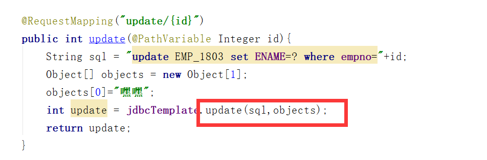

springboot自动装配原理初探

pom.xml

**核心依赖**

- spring-boot-dependencies：该依赖在父工程中
- 我们在写springboot依赖的时候，不需要指定版本，就是因为这些版本仓库

**启动器**

- ```xml
    <dependency>
        <groupId>org.springframework.boot</groupId>
        <artifactId>spring-boot-starter</artifactId>
    </dependency>
    ```

- 启动器：就是springboot的启动场景

- 比如spring-boot-starter-web，springboot就会自动导入web环境下的所有依赖

- springboot将所有的功能场景，编程一个一个的启动器

- 我们使用什么功能，只需要添加相应的启动器即可

**主程序**

- @SpringBootApplication:标注这个类是springboot应用！

- ```bash
    @SpringBootConfiguration:springboot的配置
    	@Configuration：表示spring配置类
    		@Component：spring的一个组件
    @EnableAutoConfiguration：自动配置
    	@AutoConfigurationPackage：自动配置包
    	@Import({AutoConfigurationImportSelector.class})：导入选择器
    		AutoConfigurationImportSelector.class
    		getCandidateConfigurations();  获取配置的方法
    			
    ```

- 

- 自动配置的核心文件


*springboot自动装配*	**精髓**

- Springboot会加载大量的自动配置类
- 看我们需要的功能有没有在Springboot默认的装配类中
- 我们再看这个自动配置类中配置了那些组件（只要我们要用的组件在内，我们就不需要手动配置了）
- 给容器中自动配置类添加组件的时候，会从properties类中获取某些属性，我们只需要在配置文件中指定这些属性的值即可
- XXXAutoConfiguration：自动配置类：给容器中添加组件
- XXXProperties：封装配置文件中的相关属性

# 谈谈你对springboot的理解

- **自动装配**

    ```
    @SpringBootApplication		=>@EnableAutoConfiguration=>@Import({AutoConfigurationImportSelector.class})
    =>getAutoConfigurationEntry()=>getCandidateConfigurations()=>loadFactoryNames=>loadSpringFactories=>"META-INF/spring.factories"=>configurations
    @ConditionalOnXXX()判断是否生效
    ```

- **run()**

    - 推断应用的类型是普通项目还是web项目
    - 查找并加载所有可用的初始化器，设置到initializers属性中
    - 找出所有应用程序的监听器，设置到listener
    - 推断设置main方法的定义类，找到运行的主类


**全面接管springmvc的配置**


# yaml语法

```bash
#yaml语法中对空格要求极其严格！
server:
	port: 8080
	
#可以存对象，并且可以注入
student:
	name: haha
	age: 13
	sex: 男
#可以存数组
array:
	- pig
	- dog
	- cat
#数组还可以写成：
array: [pig,dog,cat]
```

**springboot配置文件可以写在哪**(上面的可以把下面的覆盖)

`file ./config/`

`file ./`

`file classpath/config/`

`file classpath/`

**springboot多环境配置**


# springboot web项目静态资源

**总结：**

- 在Springboot中可以用以下方式处理静态资源

    webjars		localhost:8080/webjars/

    public ,static, resources, /**		localhost:8080/

- 优先级：resources   >  static  >  public


# 首页和图标定制

放在静态资源目录（public,static,resources）下，名字为index.html，默认访问localhost:8080就会跳转到index.html

**图标**

​	在html中的head中加入以下代码（老版本与新版本有不同）

```bash
 <link rel="icon" href="/favicon.ico"/>
```

# 国际化

- 首先编写`xxx.properties`属性文件
- index.html中用`th:text="#{left.fen}"`或者`<h1>[[#{left.fen}]]</h1>`
- 
- 配置springboot的配置文件，添加`spring.message.basename=自己编写的xxx.properties`
- 
- 编写自定义LocaleResolver，就是说写一个类实现这个接口
- 
- 添加到Bean中，注意
- 
- index.html中编写`th:href=@{/index.html(l='zh_CN')}`,thymeleaf中参数用在（）里面写

- 


# 拦截器

- 创建自定义拦截器，创建一个类实现`HandlerInterceptor`
- 在实现了`WebMVCConfigurer`下的类中重写`addInterceptors`


# thymeleaf（模板引擎）

```bash
th:text="${XXX}"		${}这是表达式
th:href="@{XXX}"		@{}这里面写地址
th:text="#{XXX}"		#{}这里面可以拿属性（properties）文件中的值，通常国际化的时候可以使用

th:fragment="XXX"		fragment定义组件
th:replace="~{}"		replace引用组件（替换）
如：<div th:replace="~{commonts/side_head::sidebar}"></div>
th:insert="~{}"			insert也是引用组件（插入），直白来说多了一层div，所以通常都是用replace
如：<div th:insert="~{commonts/side_head::sidebar}"></div>

```

***注意：*th接管JavaScript的问题-**

```bash
th:onclick="onload( ${emp.getId()} )"	th接管JavaScript时,${}会有问题，可以用以下方式解决
```

- **以前写法(*请放弃！！！*)：**

方式一：

```bash
  <button class="btn" th:onclick="'getName(\'' + ${person.name} + '\');'">获得名字</button>
```

方式二：

```bash
	<button class="btn" th:onclick="'getName(' + ${person.name} + ');'">获得名字</button>
```

方式三：

```bash
   <button th:onclick="|getName(${person.name} )|">获得名字</button>
```

**比较好的写法时（idea下会报个错，但是不影响）**

 ```bash
<button class="btn" th:onclick="getName( [[${person.name}]] );">获得名字</button>
 ```


# springboot整合数据库

- 导入jdbc驱动包

    

- 导入数据库驱动包，这里以oracle为例


**可以在测试类中测试**

 

# springboot中的jdbcTemplate模板

路径`org.springframework.boot.autoconfigure.jdbc.JdbcTemplateConfiguration `


- 查看所有员工


- 修改一个员工

    ****

**其他增删操作大致与修改一致**

# springboot中整合druid数据源

示例：druid（德鲁伊）

- 先导入依赖

    ```xml
    <!-- druid数据源 -->
    <dependency>
        <groupId>com.alibaba</groupId>
        <artifactId>druid</artifactId>
        <version>1.1.22</version>
    </dependency>
    <!--log4j-->
    <dependency>
        <groupId>log4j</groupId>
        <artifactId>log4j</artifactId>
        <version>1.2.17</version>
    </dependency>
    ```

    

- 在配置文件中指定`spring.dataSource.type`就ok了（切换其他数据源跟这个一样）

    ```bash
    spring:
      datasource:
        url: jdbc:oracle:thin:@localhost:1521:orcl
        username: scott
        password: scott
        driver-class-name: oracle.jdbc.OracleDriver
        type: com.alibaba.druid.pool.DruidDataSource	#这一行切换数据源**springboot中druid监控实现**
    ```

## springboot中druid数据源监控

注入druid数据源的属性

- 创建自己的配置MyDruidConfig配置类

```bash
@Configuration
public class MyDruid{
	//配置与yml的位置
    @ConfigurationProperties(prefix = "spring.datasource")
    //注入bean
    @Bean
    public DruidDataSource druidDataSource(){
        return new DruidDataSource();
    }

    //后台监控
    @Bean
    public ServletRegistrationBean servletRegistrationBean(){
    //第一个构造器参数表示要用监控，第二个参数这个页面如何访问（访问路径）
        ServletRegistrationBean<Servlet> bean = new ServletRegistrationBean<>(new StatViewServlet(),"/druid/*");
        Map<String, String> initMap = new HashMap<>();
        
        //设置访问的账号密码，注意账号和密码的key是固定的loginUsername与loginPassword
        initMap.put("loginUsername","admin");
        initMap.put("loginPassword","admin");
        
        //允许谁来访问
        initMap.put("allow","");//如果是空字符串表示所有人可以访问
    	
		//设置一些初始化参数
        bean.setInitParameters(initMap);
        return bean;
    }

    //过滤器
    @Bean
    public FilterRegistrationBean webStartFilter(){
        FilterRegistrationBean bean =   new FilterRegistrationBean();
        Map<String, String> initMap = new HashMap<>();

        //设置一个过滤器
        bean.setFilter(new WebStatFilter());

        //不监控那些请求，参数exclusions
        initMap.put("exclusions","*.js,*.css,/druid/*");

        bean.setInitParameters(initMap);
        return bean;
    }
}
```

- 在yml配置文件中注入参数

    ```bash
     #Spring Boot 默认是不注入这些属性值的，需要自己绑定
     #druid 数据源专有配置
     initialSize: 5
     minIdle: 5
     maxActive: 20
     maxWait: 60000
     timeBetweenEvictionRunsMillis: 60000
     minEvictableIdleTimeMillis: 300000
     validationQuery: SELECT 1 FROM DUAL
     testWhileIdle: true
     testOnBorrow: false
     testOnReturn: false
     poolPreparedStatements: true
    
    #配置监控统计拦截的filters，stat:监控统计、log4j：日志记录、wall：防御sql注入
    #如果允许时报错  java.lang.ClassNotFoundException: org.apache.log4j.Priority
    #则导入 log4j 依赖即可，Maven 地址：https://mvnrepository.com/artifact/log4j/log4j
    filters: stat,wall,log4j
    maxPoolPreparedStatementPerConnectionSize: 20
    useGlobalDataSourceStat: true
    connectionProperties: druid.stat.mergeSql=true;druid.stat.slowSqlMillis=500
    ```

- 启动项目访问`locahost:8080/druid`即可进入首页

# springboot整合mybatis

- 首先导入依赖（`mybatis-spring-boot-starter`），在mvnrepository上搜索即可,或者

    ```xml
     <!--mybaits-spring-boot-starter-->
    <dependency>
        <groupId>org.mybatis.spring.boot</groupId>
        <artifactId>mybatis-spring-boot-starter</artifactId>
        <version>2.1.2</version>
    </dependency>
    ```

- 编写mapper接口

    ```java
    //mapper告诉spring这是个mybatis中的mapper
    @Mapper
    //声明到spring中
    @Repository
    public interface DeptDao_1803 {
        List<Dept> getDepts();
        void addDept(Dept dept);
        Dept getDept(Integer id);
    }
    ```

- 编写mapper.xml，这写接口的实现可以放到resources下，建议路径`resources/mybatis/mapper`

    ```bash
    <?xml version="1.0" encoding="UTF-8" ?>
    <!DOCTYPE mapper
            PUBLIC "-//mybatis.org//DTD Mapper 3.0//EN"
            "http://mybatis.org/dtd/mybatis-3-mapper.dtd">
    <mapper namespace="com.jh.test.mapper.DeptDao_1803">
        <select id="getDepts" resultType="Dept">
          select * from DEPT_1803
        </select>
        <insert id="addDept" parameterType="dept">
            insert into DEPT_1803 values(#{deptNo},#{dName},#{loc})
        </insert>
        <select id="getDept" resultType="dept">
            select * from DEPT_1803 where DEPTNO = #{id}
        </select>
    </mapper>
    ```

- 在springboot的配置文件中设置mybatis的别名，xml的路径等参数

    ```yaml
    mybatis:
      type-aliases-package: com.jh.test.pojo
      mapper-locations: classpath:mybatis/mapper/*.xml
    ```

- 创建Controller进行测试

    ```java
    @RestController
    public class MybatisController {
        
        @Autowired
        private DeptDao_1803 deptDao_1803;
        
        @RequestMapping("list")
        public List<Dept> getDepts(){
            List<Dept> depts = deptDao_1803.getDepts();
            for (Dept d:depts) {
                System.out.println(d);
            }
            return depts;
        }
    }
    ```

- 运行项目了，浏览器请求，看页面是否输出数据

# spring security(安全)

## 


## 测试代码

- 导入`spring security`依赖

    ```xml
    <dependency>
        <groupId>org.springframework.boot</groupId>
        <artifactId>spring-boot-starter-security</artifactId>
    </dependency>
    ```

- 导入`thymeleaf`和`thymeleaf-springsecuriry`的整合包依赖

    ```xml
    <dependency>
        <groupId>org.thymeleaf</groupId>
        <artifactId>thymeleaf-spring5</artifactId>
    </dependency>
    <dependency>
        <groupId>org.thymeleaf.extras</groupId>
        <artifactId>thymeleaf-extras-java8time</artifactId>
    </dependency>
    
     <!--thymeleaf-security-->
    <dependency>
        <groupId>org.thymeleaf.extras</groupId>
        <artifactId>thymeleaf-extras-springsecurity5</artifactId>
        <version>3.0.4.RELEASE</version>
    </dependency>
    ```

    

- 创建页面（测试权限和认证）

    

- 创建`securityConfig`类继承`WebSecurityConfigurerAdapter`,并在类上加@EnableWebSecurity注解来启动security


```java
//启用security
@EnableWebSecurity
public class SecurityConfig extends WebSecurityConfigurerAdapter {
    //链式编程
    @Override
    protected void configure(HttpSecurity http) throws Exception {
        //设置所有人可以访问首页
        http.authorizeRequests().antMatchers("/").permitAll()
                                .antMatchers("/v1/**").hasRole("vip1")
                                .antMatchers("/v2/**").hasRole("vip2")
                                .antMatchers("/v3/**").hasRole("vip3");

        //没有权限默认转到登录页面
        http.formLogin();
        //开启注销功能
        http.logout().logoutSuccessUrl("/");
        //防御csrf
        /*http.csrf().disable();*/
        
        //记住我
        http.rememberMe();
    }
    @Override
    protected void configure(AuthenticationManagerBuilder auth) throws Exception {
        //可以在内存中设置用户账号和密码及权限，可以进行测试
        auth.inMemoryAuthentication().passwordEncoder(new BCryptPasswordEncoder())
                .withUser("root").password(new BCryptPasswordEncoder().encode("123123")).roles("vip1","vip2","vip3").and()
                .withUser("jh").password(new BCryptPasswordEncoder().encode("123123")).roles("vip1");
    }
}
```


# springboot解决跨域问题

- 可以在指定的方法或类上加`@CrossOrigin`注解

- 可以在配置类中重写`addCorsMappings`方法，这个是全局

    ```java
    @Configuration
    public class MyViewConfig implements WebMvcConfigurer {
        
        @Override
        public void addCorsMappings(CorsRegistry registry) {
            registry.addMapping("*")
                    .allowedHeaders("*")
                    .allowedMethods("*")
                    .allowedOrigins("*");
        }
    }
    ```

    
# shiro

## 认识shiro

- apache shiro是一个java安全（权限）框架
- Shiro可以非常容易的开发足够好的应用，其不仅可以用在JAVASE，也可用在JAVAEE
- Shiro可以完成，认证，授权，加密，会话管理，Web继承，缓存等。
- 下载地址 http://shiro.apache.org/ 

## hello word !

1. 导入依赖

```xml
<dependencies>
    <!--shiro-->
    <dependency>
        <groupId>org.apache.shiro</groupId>
        <artifactId>shiro-core</artifactId>
        <version>1.5.3</version>
    </dependency>
    <!--slf4j-->
    <dependency>
        <groupId>org.slf4j</groupId>
        <artifactId>slf4j-log4j12</artifactId>
        <version>1.7.12</version>
    </dependency>
    <dependency>
        <groupId>org.slf4j</groupId>
        <artifactId>jcl-over-slf4j</artifactId>
        <version>1.7.30</version>
    </dependency>

    <dependency>
        <groupId>log4j</groupId>
        <artifactId>log4j</artifactId>
        <version>1.2.17</version>
    </dependency>
</dependencies>
```


2. 配置文件

log4j.properties

```properties
# General Apache libraries
log4j.logger.org.apache=WARN

# Spring
log4j.logger.org.springframework=WARN

# Default Shiro logging
log4j.logger.org.apache.shiro=INFO

# Disable verbose logging
log4j.logger.org.apache.shiro.util.ThreadContext=WARN
log4j.logger.org.apache.shiro.cache.ehcache.EhCache=WARN
```

shiro.ini

```ini
[users]
# user 'root' with password 'secret' and the 'admin' role
root = secret, admin
# user 'guest' with the password 'guest' and the 'guest' role
guest = guest, guest
# user 'presidentskroob' with password '12345' ("That's the same combination on
# my luggage!!!" ;)), and role 'president'
presidentskroob = 12345, president
# user 'darkhelmet' with password 'ludicrousspeed' and roles 'darklord' and 'schwartz'
darkhelmet = ludicrousspeed, darklord, schwartz
# user 'lonestarr' with password 'vespa' and roles 'goodguy' and 'schwartz'
lonestarr = vespa, goodguy, schwartz

# -----------------------------------------------------------------------------
# Roles with assigned permissions
#
# Each line conforms to the format defined in the
# org.apache.shiro.realm.text.TextConfigurationRealm#setRoleDefinitions JavaDoc
# -----------------------------------------------------------------------------
[roles]
# 'admin' role has all permissions, indicated by the wildcard '*'
admin = *
# The 'schwartz' role can do anything (*) with any lightsaber:
schwartz = lightsaber:*
# The 'goodguy' role is allowed to 'drive' (action) the winnebago (type) with
# license plate 'eagle5' (instance specific id)
goodguy = winnebago:drive:eagle5
```


3. 编写hello word

Quickstart

```java
/*
 * Licensed to the Apache Software Foundation (ASF) under one
 * or more contributor license agreements.  See the NOTICE file
 * distributed with this work for additional information
 * regarding copyright ownership.  The ASF licenses this file
 * to you under the Apache License, Version 2.0 (the
 * "License"); you may not use this file except in compliance
 * with the License.  You may obtain a copy of the License at
 *
 *     http://www.apache.org/licenses/LICENSE-2.0
 *
 * Unless required by applicable law or agreed to in writing,
 * software distributed under the License is distributed on an
 * "AS IS" BASIS, WITHOUT WARRANTIES OR CONDITIONS OF ANY
 * KIND, either express or implied.  See the License for the
 * specific language governing permissions and limitations
 * under the License.
 */

import org.apache.shiro.SecurityUtils;
import org.apache.shiro.authc.*;
import org.apache.shiro.ini.IniSecurityManagerFactory;
import org.apache.shiro.mgt.SecurityManager;
import org.apache.shiro.session.Session;
import org.apache.shiro.subject.Subject;
import org.apache.shiro.lang.util.Factory;
import org.slf4j.Logger;
import org.slf4j.LoggerFactory;


/**
 * Simple Quickstart application showing how to use Shiro's API.
 *
 * @since 0.9 RC2
 */
public class Quickstart {

    private static final transient Logger log = LoggerFactory.getLogger(Quickstart.class);


    public static void main(String[] args) {

        // The easiest way to create a Shiro SecurityManager with configured
        // realms, users, roles and permissions is to use the simple INI config.
        // We'll do that by using a factory that can ingest a .ini file and
        // return a SecurityManager instance:

        // Use the shiro.ini file at the root of the classpath
        // (file: and url: prefixes load from files and urls respectively):
        Factory<SecurityManager> factory = new IniSecurityManagerFactory("classpath:shiro.ini");
        SecurityManager securityManager = factory.getInstance();

        // for this simple example quickstart, make the SecurityManager
        // accessible as a JVM singleton.  Most applications wouldn't do this
        // and instead rely on their container configuration or web.xml for
        // webapps.  That is outside the scope of this simple quickstart, so
        // we'll just do the bare minimum so you can continue to get a feel
        // for things.
        SecurityUtils.setSecurityManager(securityManager);

        // Now that a simple Shiro environment is set up, let's see what you can do:

        // get the currently executing user:
        Subject currentUser = SecurityUtils.getSubject();

        // Do some stuff with a Session (no need for a web or EJB container!!!)
        Session session = currentUser.getSession();
        session.setAttribute("someKey", "aValue");
        String value = (String) session.getAttribute("someKey");
        if (value.equals("aValue")) {
            log.info("Retrieved the correct value! [" + value + "]");
        }

        // let's login the current user so we can check against roles and permissions:
        if (!currentUser.isAuthenticated()) {
            UsernamePasswordToken token = new UsernamePasswordToken("lonestarr", "vespa");
            token.setRememberMe(true);
            try {
                currentUser.login(token);
            } catch (UnknownAccountException uae) {
                log.info("There is no user with username of " + token.getPrincipal());
            } catch (IncorrectCredentialsException ice) {
                log.info("Password for account " + token.getPrincipal() + " was incorrect!");
            } catch (LockedAccountException lae) {
                log.info("The account for username " + token.getPrincipal() + " is locked.  " +
                        "Please contact your administrator to unlock it.");
            }
            // ... catch more exceptions here (maybe custom ones specific to your application?
            catch (AuthenticationException ae) {
                //unexpected condition?  error?
            }
        }

        //say who they are:
        //print their identifying principal (in this case, a username):
        log.info("User [" + currentUser.getPrincipal() + "] logged in successfully.");

        //test a role:
        if (currentUser.hasRole("schwartz")) {
            log.info("May the Schwartz be with you!");
        } else {
            log.info("Hello, mere mortal.");
        }

        //test a typed permission (not instance-level)
        if (currentUser.isPermitted("lightsaber:wield")) {
            log.info("You may use a lightsaber ring.  Use it wisely.");
        } else {
            log.info("Sorry, lightsaber rings are for schwartz masters only.");
        }

        //a (very powerful) Instance Level permission:
        if (currentUser.isPermitted("winnebago:drive:eagle5")) {
            log.info("You are permitted to 'drive' the winnebago with license plate (id) 'eagle5'.  " +
                    "Here are the keys - have fun!");
        } else {
            log.info("Sorry, you aren't allowed to drive the 'eagle5' winnebago!");
        }

        //all done - log out!
        currentUser.logout();

        System.exit(0);
    }
}
```


## shiro的Subject

```java
//获取当前用户
Subject currentUser = SecurityUtils.getSubject();
//获取当前用户session
Session session = currentUser.getSession();
//设置session值
session.setAttribute("someKey", "aValue");
//通过session键获取值
String value = (String) session.getAttribute("someKey");
//是否认证
currentUser.isAuthenticated()
//token令牌
UsernamePasswordToken token = new UsernamePasswordToken("lonestarr", "vespa");
 //记住我
token.setRememberMe(true);
//执行登录
currentUser.login(token);
//获取当前用户的信息
currentUser.getPrincipal();
//当前用户是否拥有schwartz角色
currentUser.hasRole("schwartz");
//当前用户是否有某个权限
currentUser.isPermitted("lightsaber:wield")
//登出
currentUser.logout();
```


## springboot整合shiro（实现拦截）

1. 导入依赖

```xml
<!-- shiro-spring-->
<dependency>
    <groupId>org.apache.shiro</groupId>
    <artifactId>shiro-spring</artifactId>
    <version>1.5.3</version>
</dependency>
```

2. 编写UserRealm类

```java
public class UserRealm extends AuthorizingRealm {
    //授权
    @Override
    protected AuthorizationInfo doGetAuthorizationInfo(PrincipalCollection principalCollection) {
        AuthorizationInfo authorizationInfo = new SimpleAuthorizationInfo();
        System.out.println("这里执行了授权");
        return authorizationInfo;
    }

    @Override
    protected AuthenticationInfo doGetAuthenticationInfo(AuthenticationToken authenticationToken) throws AuthenticationException {
        AuthenticationInfo authenticationInfo = new SimpleAuthenticationInfo();
        System.out.println("这里执行了认证");
        return authenticationInfo;
    }
}
```

3. ShiroConfig配置类

```java
@Configuration
public class ShiroConfig {
    //shirofilterfactorbean
    @Bean
    public ShiroFilterFactoryBean shiroFilterFactoryBean(@Qualifier("securityManager") DefaultWebSecurityManager securityManager){
        ShiroFilterFactoryBean bean = new ShiroFilterFactoryBean();
        //设置安全管理器
        bean.setSecurityManager(securityManager);
        Map<String, String> filterChainDefinitionMap = new LinkedHashMap<>();
        /*
        anon    所有人可以访问
        authc   认证后访问
        user    必须拥有记住我后访问
        perms   拥有某个资源的访问权限后访问
        role    拥有某个角色访问
         */
        filterChainDefinitionMap.put("/add","anon");
        filterChainDefinitionMap.put("/update","authc");

        bean.setFilterChainDefinitionMap(filterChainDefinitionMap);
        //设置跳转页面
        bean.setLoginUrl("/login");


        return bean;
    }
    //default
    @Bean(name="securityManager")
    public DefaultWebSecurityManager defaultWebSecurityManager(@Qualifier("userRealm") UserRealm userRealm){
        DefaultWebSecurityManager defaultWebSecurityManager = new DefaultWebSecurityManager();
        defaultWebSecurityManager.setRealm(userRealm);
        return new DefaultWebSecurityManager();
    }
    //realm
    @Bean
    public UserRealm userRealm(){
        return new UserRealm();
    }

}
```

4. 编写controller实现跳转

```bash
@Controller
public class MyController {
    @RequestMapping("/index")
    public String index(Model model){
        System.out.println(1111);
        model.addAttribute("msg","hello,shiro");
        return "index";
    }
    @RequestMapping("/add")
    public String add(){
        return "user/add";
    }
    @RequestMapping("/update")
    public String update(){
        return "user/update";
    }
    @RequestMapping("/login")
    public String login(){
        return "user/login";
    }
}
```

html页面就不写了，index页面有两个按钮可以跳转到add.html,和update.html

## shiro的用户认证

1. 在controller中编写登录逻辑

```java
 @RequestMapping("/toLogin")
    public String toLogin(String username,String password,Model model){
        //获取当前用户
        Subject subject =   SecurityUtils.getSubject();
        //获得令牌
        UsernamePasswordToken token = new UsernamePasswordToken(username,password);   
        try {
            //登录这个令牌
            subject.login(token);
            return "index";
        }catch(UnknownAccountException e){
            model.addAttribute("msg","账号不存在");
            return "user/login";
        }catch (IncorrectCredentialsException e){
            model.addAttribute("msg","密码不正确");
            return "user/login";
        }
    }
```

2. 在UserRealm中写

```java
@Override
    protected AuthenticationInfo doGetAuthenticationInfo(AuthenticationToken authenticationToken) throws AuthenticationException {
        
        
        System.out.println("执行了认证");
        String username = "root";
        String password = "123456";
        UsernamePasswordToken token = (UsernamePasswordToken)authenticationToken;
        //如果账号不存在
        if(!token.getUsername().equals(username)){
            //返回null会默认抛出UnknownAccountException异常
            return null;            //UnknownAccountException
        }
        return new SimpleAuthenticationInfo("",password,"");
        
        
    }
```


## shiro整合mybatis(其实就是以前的操作)

1. 导入依赖

```xml
<!--mybaits-->
<dependency>
    <groupId>org.mybatis.spring.boot</groupId>
    <artifactId>mybatis-spring-boot-starter</artifactId>
    <version>2.1.2</version>
</dependency>
<!--druid-->
<dependency>
    <groupId>com.alibaba</groupId>
    <artifactId>druid</artifactId>
    <version>1.1.22</version>
</dependency>
<!--oracle驱动-->
<dependency>
    <groupId>com.oracle</groupId>
    <artifactId>ojdbc6</artifactId>
    <version>11.2.0.3.0</version>
</dependency>
```

2. 编写dao层和xml文件

UserDao.java

```java
@Mapper
@Repository
public interface UserDao {
    public User queryUserByName(String userName);
}
```

UserDao.xml

```xml
<?xml version="1.0" encoding="UTF-8" ?>
<!DOCTYPE mapper PUBLIC "-//mybatis.org//DTD Mapper 3.0//EN"
        "http://mybatis.org/dtd/mybatis-3-mapper.dtd">
<mapper namespace="com.jh.mapper.UserDao">

    <select id="queryUserByName" parameterType="String" resultType="user">
        select * from user_shiro where username=#{username}
    </select>

</mapper>
```


3. 编写配置文件

```properties
spring.thymeleaf.cache=false

spring.datasource.url=jdbc:oracle:thin:@localhost:1521:orcl
spring.datasource.username=smk
spring.datasource.password=smk
spring.datasource.driver-class-name=oracle.jdbc.OracleDriver
spring.datasource.type=com.alibaba.druid.pool.DruidDataSource


mybatis.type-aliases-package=com.jh.pojo
mybatis.mapper-locations=classpath:mybatis/*.xml
```

4. UserRealm

```java
//认证
    @Override
    protected AuthenticationInfo doGetAuthenticationInfo(AuthenticationToken authenticationToken) throws AuthenticationException {
        System.out.println("=================>执行了认证");
        UsernamePasswordToken token = (UsernamePasswordToken)authenticationToken;
        //交互数据库（多了这个）
        User user = userDao.queryUserByName(token.getUsername());
        if(user==null){
            return null;
        }

        return new SimpleAuthenticationInfo(user,user.getPassWord(),"");
    }
```

## shiro授权

可以在表中加权限字段

- shiroConfig这个是shiro的配置文件

```java
@Configuration
public class ShiroConfig {
    //ShiroFilterFactoryBean
    @Bean
    public ShiroFilterFactoryBean shiroFilterFactoryBean(@Qualifier("securityManager") DefaultWebSecurityManager securityManager){
        ShiroFilterFactoryBean bean = new ShiroFilterFactoryBean();
        //设置安全管理器
        bean.setSecurityManager(securityManager);
        HashMap<String, String> map = new LinkedHashMap<>();
         /*
        anon    所有人可以访问
        authc   认证后访问
        user    必须拥有记住我后访问
        perms   拥有某个资源的访问权限后访问
        role    拥有某个角色访问
         */
        map.put("/index","anon");//anon允许所有人访问
        
        
        
//*********************在这里配置perms*******************************        
        map.put("/add","perms[user:add]");//
        map.put("/update","perms[user:update]");//
//*****************************************************************


        bean.setFilterChainDefinitionMap(map);
        //如果没有认证跳到哪个页面
        bean.setLoginUrl("login");
        bean.setUnauthorizedUrl("unAuthorized");

        return bean;
    }
    //defaultWebSecurityManager
    @Bean(name="securityManager")
    public DefaultWebSecurityManager defaultWebSecurityManager(@Qualifier("userRealm") UserRealm realm){
        return new DefaultWebSecurityManager(realm);
    }
    
    //realm
    @Bean
    public UserRealm userRealm(){
        return new UserRealm();
    }
	//配置shiro与thymeleaf整合
    @Bean
    public ShiroDialect shiroDialect(){
        return new ShiroDialect();
    }
}
```

- 在UserRealm的中配置

```java
//授权
    @Override
    protected AuthorizationInfo doGetAuthorizationInfo(PrincipalCollection principalCollection) {
        System.out.println("==============>用户执行了授权");
        SimpleAuthorizationInfo info = new SimpleAuthorizationInfo();
        //获取当前的用户
        Subject subject = SecurityUtils.getSubject();
        //给当前用户授权
        info.addStringPermission(((User)subject.getPrincipal()).getQx());
        return info;
    }
```

## shiro与thymeleaf整合

1. 导入依赖

```xml
<!--thymeleaf-shiro-->
<dependency>
    <groupId>com.github.theborakompanioni</groupId>
    <artifactId>thymeleaf-extras-shiro</artifactId>
    <version>2.0.0</version>
</dependency>
```

2. 在shiro的配置文件中注入`ShiroDialect`

```java
@Bean
public ShiroDialect shiroDialect(){
    return new ShiroDialect();
}
```


