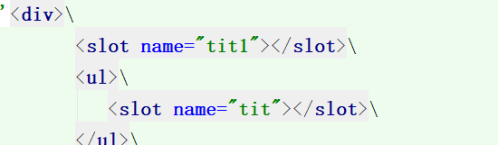

# 									vue（核心：以数据驱动，组件化）

## 判断-循环

```bash
v-if
v-else-if
v-else
v-for="item int items"
```

## 事件

```bash
v-on:click="method"		#绑定事件
```

## 组件

```bash
Vue.component("",{
	props: [],
	template: ''
});
```

## 双向数据绑定（vue.js的精髓之处）

```bash
v-model
```

## 网络通信

```bash
axios.get().then()		#axios

axios({
	method: "get/post",
	url: ""
}).then((response)=>{
	console.log(response);
});

$.ajax({
	
})						#ajax
```


常见钩子函数

```bash
beforeRouteEnter:(to,from,next)=>{}		#进入路由之前
###	to将要去的路径	from从哪里来	next()相当于chain，向下执行
next('path')	#直接跳转到path
next(false)		#跳转当前页
beforeRouteLeave:(to,from,next)=>{}		#进入路由之后
```


## 插槽（slot）


```
数组.splice(index,1);		#从第index个向后删除1位
```


# 安装nodejs

直接安装

```bash
node -v		#查看版本号
npm -v 		#查看npm版本号
##第一步
npm install cnpm -g	
#安装淘宝镜像或者下面
npm install -g cnpm --registry=https://registry.npm.taobao.org

##第二步安装脚手架
cnpm install -g @vue/cli
##第三步
cnpm install -g @vue/cli-init

vue init webpack myvue	#创建一个基于webpack的vue应用程序
##第四步
cd myvue
cnpm install	#安装所有依赖
cnpm run dev		##启动项目
http//localhost:8000

```

## 安装webpack打包工具(我们的主要作用就是把ecmaScript6转化位ecmaScript5)

```bash
cnpm install webpack -g   #安装webpack
cnpm install webpack-cli -g

##打包
webpack
webpack --watch		##监听(实时打包)

```

## 安装路由(router)

```bash
cnpm install vue-router --save-dev

```

安装element ui

```bash
cnpm i element-ui -S

```


# 完整的一个项目创建

```bash
vue init webpack myvue				#创建一个基于webpack的vue应用程序
cnpm install vue-router --save-dev	#安装路由
cnpm i element-ui -S				#安装element ui,	-S时save的缩写
cnpm install						#安装所有依赖
cnpm install sass-loader node-sass --save-dev		#安装sass加载器
cnpm install axios vue-axios --save-dev		#安装axios
cnpm run dev						##启动项目


```

# git淘宝镜像

```bash
https://npm.taobao.org/mirrors/git-for-windows/

```

