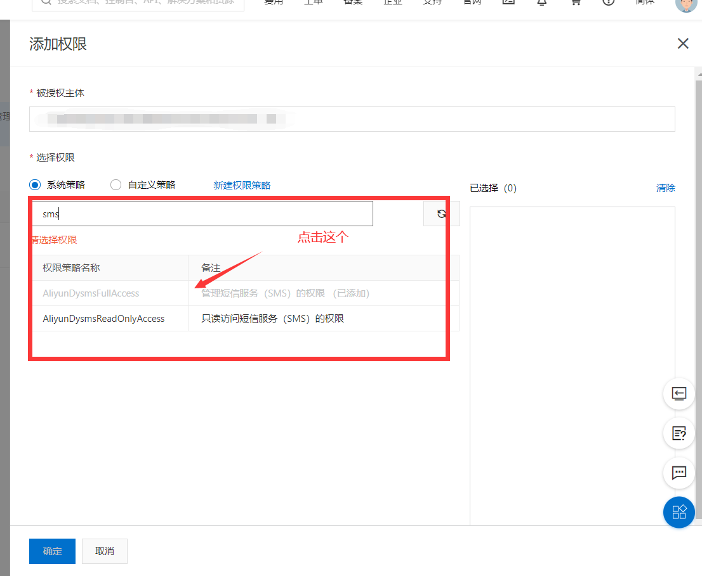

# 阿里云短信验证码

- 注册阿里云账号并登录

- 点击右上角的头像进入账号管理页面

- 再次移动到右上角头像（不要点击），出现下拉菜单，点击菜单中的Accesskey管理

    


- 进入之后出现弹窗，点击开始使用子用户AccessKey

    

- 创建用户组，创建用户，将用户添加到用户组中
- **创建完成之后一定要把AccessKey的密码记住，只显示这一次！！！，最好保存到本地**

- 为用户组添加权限

    



之后直接点点击确定

- 在首页上方搜索短信服务，点进去进入短信服务，如果没有开通就开通

- 点击国内消息，在签名管理添加签名，在模板管理添加模板

    **添加签名**

    

**添加模板**


- 导入依赖

    ```xml
     <!-- https://mvnrepository.com/artifact/com.alibaba/fastjson -->
            <dependency>
                <groupId>com.alibaba</groupId>
                <artifactId>fastjson</artifactId>
                <version>1.2.68</version>
            </dependency>
    
    <!-- https://mvnrepository.com/artifact/com.aliyun/aliyun-java-sdk-core -->
    <!--如果这个导入失败就去mvnrepository网站上下载最新版-->
            <dependency>
                <groupId>com.aliyun</groupId>
                <artifactId>aliyun-java-sdk-core</artifactId>
                <version>4.5.1</version>
            </dependency>
    ```

- 写入代码

    ```java
     DefaultProfile profile = DefaultProfile.getProfile("cn-hangzhou", "AccessKey的Id", "AccessKey的密码");//输入账号和密码
            IAcsClient client = new DefaultAcsClient(profile);
    
            CommonRequest request = new CommonRequest();
            request.setSysMethod(MethodType.POST);
            request.setSysDomain("dysmsapi.aliyuncs.com");	//不要动
            request.setSysVersion("2017-05-25");	//不要东
            request.setSysAction("SendSms");	//不要动
    
            request.putQueryParameter("PhoneNumbers","手机号");
            request.putQueryParameter("SignName","自己的签名");
            request.putQueryParameter("TemplateCode","模板编号");
            Map<String, Object> map = new HashMap<>();
            
            map.put("code",1122);	//要输出的验证码，一般使用随机数，这里为了方便
            request.putQueryParameter("TemplateParam", JSONObject.toJSONString(map));
            try {
                CommonResponse response = client.getCommonResponse(request);
                System.out.println(response.getData());
            } catch (ServerException e) {
                e.printStackTrace();
            } catch (ClientException e) {
                e.printStackTrace();
            }
    ```

    

